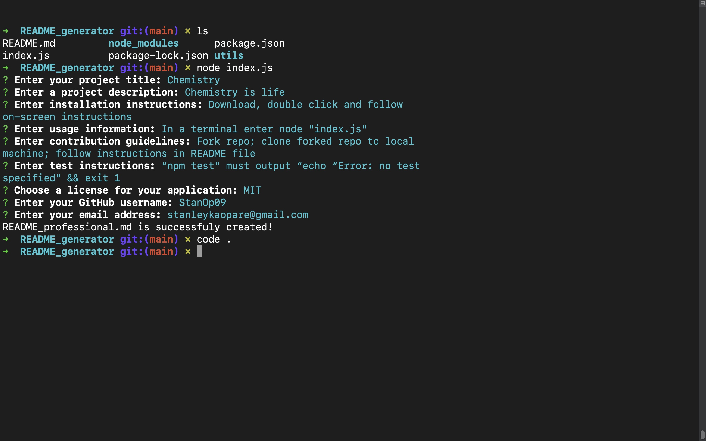

# 09 Node.js: Professional README Generator

## Description

Github offers creators the opportunity to  create open source applications. Typically users of this applocation can contribute and make suggestions to improve on it. It is therefore very important to have a good professional README.md file for interesting parties to read. It generally covers what the app is for, how to use the app, how to install it, how to report issues, and how to make contribution. This project focuses on using command-line application to autogenerate README.md file dynamically by guiding the user to provide responses based on asked questios. This will help manage the time spent by developers and creators effectively. The [Inquirer package](https://www.npmjs.com/package/inquirer/v/8.2.4) package was used in this project.

The application will be invoked by using the following command:

```bash
node index.js
```

Link to a walkthrough video that demonstrates its functionality is at .

## Table of Contents
- [User Story](#UserStory)
- [Acceptance Criteria](#AcceptanceCriteria)
- [Appearance and  Functionality](#Appearance&Functionality)
- [Credits](#Credits)

## User Story

```md
AS A developer
I WANT a README generator
SO THAT I can quickly create a professional README for a new project
```

## Acceptance Criteria

The following acceptance criteria was adopted from [Gitlab](https://git.bootcampcontent.com/University-of-Toronto/UTOR-VIRT-FSF-PT-05-2023-U-LOLC/-/tree/main/09-NodeJS/02-Challenge)

```md
GIVEN a command-line application that accepts user input
WHEN I am prompted for information about my application repository
THEN a high-quality, professional README.md is generated with the title of my project and sections entitled Description, Table of Contents, Installation, Usage, License, Contributing, Tests, and Questions
WHEN I enter my project title
THEN this is displayed as the title of the README
WHEN I enter a description, installation instructions, usage information, contribution guidelines, and test instructions
THEN this information is added to the sections of the README entitled Description, Installation, Usage, Contributing, and Tests
WHEN I choose a license for my application from a list of options
THEN a badge for that license is added near the top of the README and a notice is added to the section of the README entitled License that explains which license the application is covered under
WHEN I enter my GitHub username
THEN this is added to the section of the README entitled Questions, with a link to my GitHub profile
WHEN I enter my email address
THEN this is added to the section of the README entitled Questions, with instructions on how to reach me with additional questions
WHEN I click on the links in the Table of Contents
THEN I am taken to the corresponding section of the README
```

## Appearance and  Functionality

Click on [README_generator](https://watch.screencastify.com/v/WoIu8nRrp1CxQuzxykua) to watch the video walkthrough.


## Credits

Sean Roshan

[NPM](https://www.npmjs.com/)

[NodeJS](https://nodejs.org/en)

[Inquirer](https://www.npmjs.com/package/inquirer)
